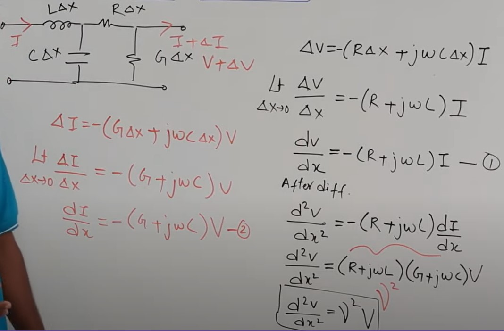
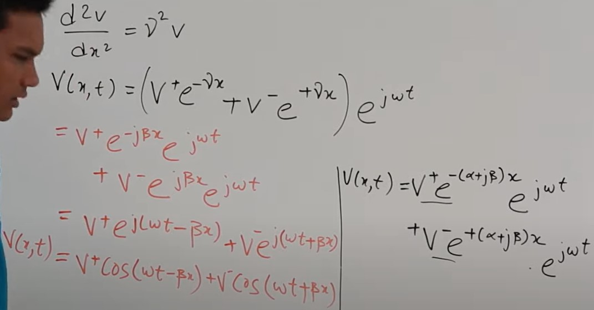
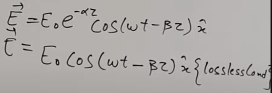

Microwave Components
- Passive Components `Important`
    * [Transmission Line](https://www.youtube.com/watch?v=-LS8qhXTN9M&list=PLuVz54MGu97Caj4fn1_5Vsdrr_PCOLK37)
    * Couples
    * Power Dividers
    * Filters
    * Isolaters
    * Duplexers
    * Phase Shifters  
    * Antennas `Not Important`
- Active Components `Not Important`
    * Power Amplifier
    * Low Noise Amplifier
    * MIxers
    * Oscillaators
    * High Power Generators  
#### Transmission Lines
* Transmission line Parameters `R,L,G,C`
* Transmission Line Eqn
* Coaxial Cable
* Time harmonic Concept
* Telegraph Eqn
* Wave Eqn of Transmission Line
* Cases (Lossless , Distortionless line)
* A line acting as an antena can disturb source & act like Capacitor , Inductor , Radiator.
* Velocity of a wave in a line.
* Paverage for a signal .
* Matching of Transmission Line.
* Smith Chart
* Power transfer in transmission Line
* Theory of small Reflection
* Intrinsic Impidance
* Wave Impidance
* Characteristic Impidance
* Compare the Impidances
* Voltage Wave
* Current Wave
* Poynty Vector Theorem
* Different Cases of Generator & Load Mismatches
    * Load Mismatched to line
    * Generator matched to load
    * Conjugate matching
* The terminated lossy line
* The porturbation Method for calculating attenuation
* Eqns Describing Smith Chart

#### Transmissionline Eqns
- [TP](https://www.youtube.com/watch?v=b_VCIdXEK2I)
- The units of the parameters sre in `per meter` to find the absolute value multiply $\Delta_x$
- Now `Inductance` $L\Delta_x$ `Resistance` $R\Delta_x$ `Cunductance` $G\Delta_x$ `Capacitance` $C\Delta_x$
- `Current` $I + \Delta I$ `Voltage` $V +\Delta V$
- $\Delta V = - (R+j \omega l \Delta_x)I$ the negative sign is because input voltage is greater than (equalto ) output voltage.
- $\lim_{\Delta_x \to 0} \frac{\Delta V}{\Delta X} = - (R+j \omega l)I = \frac{dV}{dX}$
- $\Delta I = \frac{dI}{dX} = - (G+j \omega C)V$  

- $V(x,t) = ( V^+ e^{- \gamma x} + V^- e^{+ \gamma x}) e^{j \omega t}  $
- $\gamma = \alpha + j \beta$ 
- $\gamma$ `Propogation constant` $\alpha$ `Attenuation Const` $\beta$ `Phase Const`
- For lossless medium ($\alpha = 0$) no attenuation  
  

- Above eqn shows that voltage is a wave.Due to similarities.

#### Smith Chart
- Stub Matching Problem
    - Series
        - O/c Open Circuit
        - S/c Short Circuit
    - Shunt
        - O/c Open Circuit
        - S/c Short Circuit
-  The goal that stubs are designed to accomplish is to cancel out the `reactive component` of the load to be matched, thus they will only work at a specific frequency.
- Components
    - Constant Resistance circle
    - constant Inductance/capacitance line (Inductive/Capacitive half)
    - constant VSWR Circle
    - 1 round is 1/2 $\lambda$ L length of the transmission line

### Impedance Matching & Tuning
**Lumped Element Matching**
- [Analytical](https://www.youtube.com/watch?v=_0AeDRugpqY)
- [Smith Chart](https://www.youtube.com/watch?v=-UxkFRx_kQU)

**Single Stub Tuning**

**Double Stub Tunning**

**The Quarter Wave Transformer**

[**Theory of small Reflections & Multisection Transformer**](https://www.youtube.com/watch?v=KT7Uovcp6xU)

## Microwave Network Analysis

[**Lossless Network & Reciprocal Network**](https://www.youtube.com/watch?v=o1PIzXDYl3A)

`Q` Why we don't make the load resistance equal to the source resistance and have matching ? 

## PYQ

**18-19 Midsem Autumn**  

`1`
`i) A load impedance of ZL=80+j20𝜴 is to be matched to a Zo=100𝜴 line using a length 𝑙 of lossless line of characteristic impedance Z1. Find the required Z1(real).`  
Impedance Matching [Using Formula](https://www.youtube.com/watch?v=qfJYzhwSNmc) | [Using Smith chart]()

`ii) Write down the mathematical formula for average Power flow and Return loss in a Transmission line.`

`iii) What are the input impedances for a transmission line terminated in a short circuit and open circuit?`

