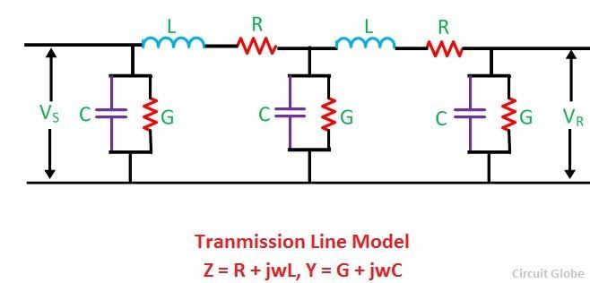

### TRANSMISSION LINES 
- Transmission Line Parameters 
- Transmission Line Equations  
- Input Impedance, Standing Wave Ratio, and Power  
- The Smith Chart  

#### Transmission Line Parameters
- 4 Parameters that affect the performance of a transmission line .
    * L Inductance
    * R Resistance
    * C Capacitance
    * G Conductance
        * Neglect (Due to leakage over line insulators)
    * `R , L` are in series `C , G` are in shunt

- Change `R,L,G,C` to change the performance (Power transmitted , Power lossed) of the transmision line.
- $$Z_{series} = R + j \omega l$$
- $$ \omega l = x \Longleftrightarrow x = 2 \pi f l$$
- For AC $\lambda = Li$ rms.
- #### Inductance
    * Uniformly distributed along the line ($e = L(\frac{di}{dt})$ `volts` or $L = \frac{d\psi}{di}$ `Henry` )
        * e is the voltage around the inductor and $\psi$ is the flux linkage in weber .
    * Mutual Inductance 
    * $M_{12} = \frac{\lambda_{12}}{I_2} H$
 

#### Transmission Line Equations
#### Input Impedance, Standing Wave Ratio, and Power
#### The Smith Chart
- [Detailed Explanation](https://www.youtube.com/watch?v=TsXd6GktlYQ)

#### Double ckt transmission 
- Reliability + transmitting more power
#### Lump Network

